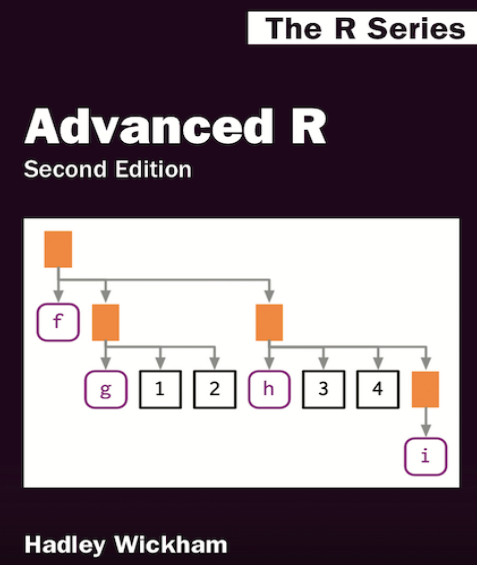

```{r setup, include=FALSE}
options(htmltools.dir.version = FALSE)
```

class: inverse, center, middle


# Club de lectura

Esta es la sesión 1 del club de lectura R Ladies México

Estamos leyendo **Advanced R** de Hadley Wickham.

[https://adv-r.hadley.nz/](https://adv-r.hadley.nz/)

<!-- {width=100px} -->

```{r, echo=FALSE, out.width="400px"}

```

---

class: middle

## El plan

Leer y resolver los ejercicios juntas de Advanced R.

Nos reuniremos cada 2 semanas, en un evento organizado por cada capítulo de R-Ladies México. 

Puedes encontrar el material en Github 
<a href="https://github.com/RLadiesMX/club-lectura-advr"><i class="fa fa-github fa-fw"></i>&nbsp; https://github.com/RLadiesMX/club-lectura-advr</a><br>

Cada capítulo del libro será guiado por una voluntaria nueva, puedes registrarte como voluntaria en <a href="https://rladiesmx.github.io/club-lectura-advr"><i class="fa fa-link fa-fw"></i>&nbsp; https://rladiesmx.github.io/club-lectura-advr</a><br>


---


background-image: url("https://media.giphy.com/media/o0vwzuFwCGAFO/giphy.gif")
background-position: 50% 50%
class: center, inverse

# Empecemos


---

# Capitulo 2 Nombres y valores

https://adv-r.hadley.nz/names-values.html

La forma en que R asigna nombres a objetos y valores no es exactamente lo que piensas.

Este capítulo explora la asignación de nombres/valores y lo que esto significa para el uso de la memoria y la velocidad de su código.

Repasaremos el capítulo y luego resolveremos algunos ejercicios juntos.

- 2.1 Introducción  
- 2.2 Conceptos básicos de asociación
- 2.3 Copiar al modificar
- 2.4 Tamaño del objeto
- 2.5 Modificar en uso
<!-- - 2.6 Desvincular -->

---
class: middle

## Prerrequisitos


### Setup

```{r, eval = F}
install.packages("lobstr")
```

```{r}
library(lobstr)
```

---

## 2.1 Introducción  


### Quiz

1) Dado el siguiente data frame, ¿cómo puedo crear una nueva columna llamada "3" que contiene la suma de 1 y 2? Solo puedes usar `$`, no `[[`. ¿Qué hace que 1, 2 y 3 sean complicados como nombres de variables?

```{r, eval=F}
df <- data.frame(runif(3), runif(3))
names(df) <- c(1, 2)
```

--

2) En el siguiente código, ¿cuánta memoria ocupa `y`?
```{r, eval=F}
x <- runif(1e6)
y <- list(x, x, x)
```

--

3) En el siguiente ejemplo, ¿en qué línea `a` es una copia?
```{r, eval=F}
a <- c(1, 5, 3, 2)
b <- a
b[[1]] <- 10
```


---

## 2.2 Conceptos básicos de asociación
 
(*Binding basics*)


1. Crea el objeto, en este caso un vector
2. Asocia un nombre, en este caso `x`, al objeto

```{r}
x <- c(1, 2, 3)
```


--

En este caso asocia el nombre `y` al objeto.

```{r}
y <- x
```


> El nombre es el que tiene un valor.

---

## 2.2 Conceptos básicos de asociación

Identificador del objeto `lobstr::obj_addr()`

```{r}
lobstr::obj_addr(x)
```

```{r}
lobstr::obj_addr(y)
```


---

## 2.2 Conceptos básicos de asociación

### Nombres reservados 

- No puede iniciar con `_` o dígitos
- `TRUE`, `NULL`, `if`
- Funciones


```{r, eval = F}
_abc <- 1
# Error: unexpected input in "_"
```

```{r, eval = F}
if <- 10
# Error: unexpected assignment in "if <-"
```


> La lista completa de nombres reservados se puede consultar en `?reserved`

---

## 2.2 Conceptos básicos de asociación

### Asignación de nombres reservados

Pero es muy probable que al trabajar con datos creados por no usuarios de R te encuentres con nombres prohibidos. **Usa comillas invertidas** , por ejemplo:

```{r}
`_abc` <- 1
print(`_abc`)
```

```{r}
`if` <- 10
print(`if`)
```

---

## 2.3 Copiar al modificar

(*Copy-on-modify*)


```{r}
x <- c(1, 2, 3)
y <- x
y[[3]] <- 4
y
```

--

Identificador del objeto

```{r}
lobstr::obj_addr(x)
```

```{r}
lobstr::obj_addr(y)
```

--

A este comportamiento se le conoce como **copy-on-modify** o copiar al modificar. 

> Los objetos de R son inmutables.


---

## 2.3 Copiar al modificar


### `base::tracemem()`

```{r}
x <- c(1, 2, 3)
cat(tracemem(x), "\n")
```

```{r}
y <- x
y[[3]] <- 4L
```

```{r}
y[[3]] <- 5L
```

```{r}
untracemem(x)
```


---


### Listas

Las listas almacenan referencias a los valores. **No** los valores.

.pull-left[
```{r}
l1 <- list(1, 2, 3)
```


```{r}
l2 <- l1
```


]

.pull-right[
```{r}
l2[[3]] <- 4
```

<!--  -->
```{r, echo=FALSE, out.width="50%"}

```

```{r}
lobstr::ref(l1, l2)
```
]

---

## 2.4 Tamaño del objeto

(*Object size*)


Para obtener el tamaño de un objeto usa  `lobstr::obj_size()`. 


```{r}
x <- runif(1e6)
lobstr::obj_size(x)
```

```{r}
y <- list(x, x, x)
lobstr::obj_size(y)
```


---

## 2.5 Modificación en uso

(*Modify-in-place*)

Hay dos excepciones en las que R **no** crea una copia:

> 1) Si un objeto tiene solo un nombre, se modifica directamente. 

```{r}
v <- c(1, 2, 3)
lobstr::obj_addr(v)
```

```{r}
v[[3]] <- 4
lobstr::obj_addr(v)
```

**Advertencia:** R puede tener complicaciones para saber precisamente si el objecto tiene un nombre.  

<!-- This is more likely with data frames (=more likely to be copied), and it’s why they are very slow in things like for loops (=more likely to make copies). -->

<!-- Instead, try using lists instead inside big for loops– those are more efficiently indexed. -->

---

## 2.5 Modificación en uso

```{r}
x <- data.frame(matrix(runif(5 * 1e4), ncol = 5))
medians <- vapply(x, median, numeric(1))
cat(tracemem(x), "\n")
```

```{r}
for (i in 1) {
  x[[i]] <- x[[i]] - medians[[i]]
}
```

```{r, echo = F}
untracemem(x)
```

```{r}
y <- as.list(x)
cat(tracemem(y), "\n")
```

```{r}
for (i in 1) {
  y[[i]] <- y[[i]] - medians[[i]]
}
```

```{r, echo = F}
untracemem(x)
```


---

## 2.5 Modificación en uso


> 2) Los ambientes (*environments*) siempre se modifican directamente. 

Mas sobre esto en el capitulo 4 del libro. 

<!-- --- -->

<!-- ## 2.6 Desvincular -->

<!-- (*Unbinding*) -->


<!-- When you bind objects to different names, sometimes there are things floating in memory that aren’t accessed. -->

<!-- R takes care of this for you with the garbage collector (GC). -->

<!-- It will run on its own when you’re trying to allocate memory space to a new object. -->


---

class: center, middle

# ¡A los ejercicios!


---

class: center, middle


# ¡Gracias!


# Contacto

<a href="https://github.com/RLadiesMX/club-lectura-advr"><i class="fa fa-github fa-fw"></i>&nbsp; https://github.com/RLadiesMX/club-lectura-advr</a><br>
<a href="https://rladiesmx.github.io/club-lectura-advr"><i class="fa fa-link fa-fw"></i>&nbsp; https://rladiesmx.github.io/club-lectura-advr</a><br>


<!-- <a href="mailto:sonia.gmcl@gmail.com"><i class="fa fa-paper-plane fa-fw"></i>&nbsp; sonia.gmcl@gmail.com</a><br> -->
<a href="http://twitter.com/Songeo"><i class="fa fa-twitter fa-fw"></i>&nbsp; @Songeo</a><br>
<a href="http://github.com/Songeo"><i class="fa fa-github fa-fw"></i>&nbsp; @Songeo</a><br>


Presentación creada con el paquete de R [**xaringan**](https://github.com/yihui/xaringan) y el template para RLadies de [**Allison Hill**](https://alison.rbind.io/post/2017-12-18-r-ladies-presentation-ninja/).


---

# Referencias

- [Advanced R](https://adv-r.hadley.nz/)
- [R-Ladies NL Bookclub Advanced R Chapter 2](https://rladiesnl.github.io/book_club/slides/AdvR_ch2#12)
- [R-Ladies Presentation  Ninja](https://alison.rbind.io/post/2017-12-18-r-ladies-presentation-ninja/)

